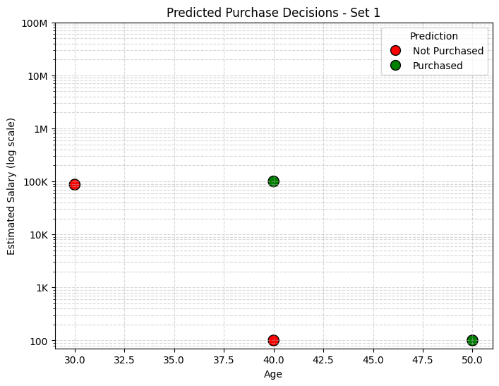
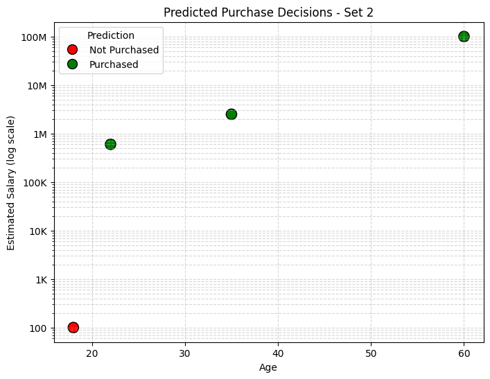

# Customer Insurance Purchase Prediction

##  Project Overview
This project predicts whether a customer will purchase insurance based on age and estimated salary. Multiple machine learning models were tested, and *K-Nearest Neighbors (KNN)* emerged as the most effective.

##  Features
- Implements Logistic Regression, KNN, SVM, Decision Tree, Random Forest
- Compares performance using Accuracy, Precision, Recall, F1-score
- Provides predictions for given scenarios
- Includes graphical analysis for purchase behavior

##  Project Structure
Customer-Insurance-Purchase-Prediction/
│── Customer_Insurance_Purchase_Prediction.ipynb
│── Social_Network_Ads.csv
│── images/
│ ├── Set-1_Prediction.png
│ ├── Set-2_Prediction.png
│── README.md

##  Technologies Used
- Python
- Scikit-learn
- Pandas
- Matplotlib
- Seaborn
- Google Colab

##  Results
- Best Model: K-Nearest Neighbors (KNN)  
- Accuracy: 92%

##  Graphs
  
 

##  How to Run
1. Clone the repository:
   git clone https://github.com/yourusername/Customer-Insurance-Purchase-Prediction.git
2. Open Customer_Insurance_Prediction.ipynb in Google Colab or Jupyter Notebook.
3. Run all cells to train models and generate predictions.

Author
Aligety Vishwagna
July 27, 2025
